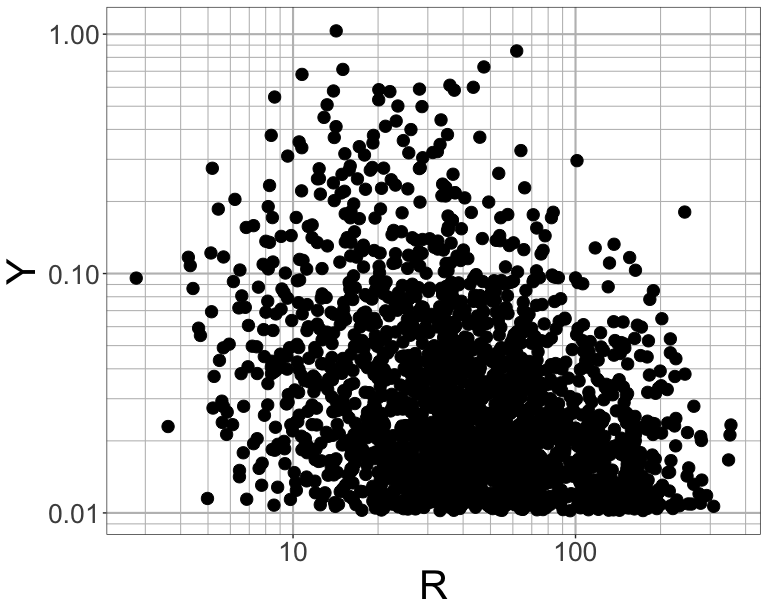

# Introduction

This document provides code to for the Iranian GMM.

## Preliminaries


```r
# load required packages
library(matrixStats)
library(cmdstanr)
library(posterior)
library(bayesplot)
library(ggplot2)
library(tidyverse)
```


```r
size_title <- 30
size_st <- 20
theme_set(theme_bw() + theme(#panel.grid.minor = element_blank(),
  axis.title = element_text(size = size_title),
  axis.text = element_text(size = size_st),
  plot.title = element_text(size = size_title),
  plot.subtitle = element_text(size = size_st),
  legend.text = element_text(size = size_st),
  legend.title = element_text(size = size_st),
  legend.key.width = unit(1, "cm"),
  legend.box.background = element_rect(colour = "black"),
  panel.grid = element_line(color = "gray",linewidth = 0.75),
  legend.spacing.y = unit(0, "pt")
))

breaks <- 10^(-10:10)
minor_breaks <- rep(1:9, 21)*(10^rep(-10:10, each=9))
lw <- 1.5
sp <- 4
wid <- 8
asp <- 0.8
```

# Read in Data

You can also embed plots, for example:


```r
periods <- c(0., 0.01,0.02,0.03,0.05,0.075,0.1,0.15,0.2,0.25,0.3,0.4,0.5,0.75, 1., 1.5, 2., 3., 4., 5., 7.5,10.)
periods2 <- c(0.005, 0.01,0.02,0.03,0.05,0.075,0.1,0.15,0.2,0.25,0.3,0.4,0.5,0.75, 1., 1.5, 2., 3., 4., 5., 7.5,10.)
n_per <- length(periods)

data_list <- jsonlite::fromJSON(file.path('STAN', 'DATA', 
                                            'data_selnew_func_faclt_sdlam_lnsigma_D10_N2193.json'))
print(c(data_list$N,data_list$NEQ, data_list$D))
```

```
## [1] 2193  363   10
```


```r
idx_p <- which(periods == 0)
df <- data.frame(M = data_list$M[data_list$eq],
           R = data_list$Rhyp,
           Y = exp(data_list$Y[,idx_p])) 
ggplot(df) +
  geom_point(aes(x = M, y = Y), size = sp) +
  scale_y_log10(breaks = breaks, minor_breaks = minor_breaks)
ggplot(df) +
  geom_point(aes(x = R, y = Y), size = sp) +
  scale_y_log10(breaks = breaks, minor_breaks = minor_breaks) +
  scale_x_log10(breaks = breaks, minor_breaks = minor_breaks)
```



# Fit

Read in the posterior samples.


```r
csv_files <- list.files(path = file.path('STAN', 'SAMPLES'), 
                        pattern = sprintf('samples_iter500_func_lt_lnsigma_missrrup_NP22_data_selnew_sdlam_lnsigma_D10_N2193_*'), full.names = TRUE)
fit <- as_cmdstan_fit(csv_files)
fit$diagnostic_summary()
```

```
## $num_divergent
## [1] 0 0 0 0
## 
## $num_max_treedepth
## [1] 0 0 0 0
## 
## $ebfmi
## [1] 0.4662695 0.5515044 0.5582449 0.4979348
```

```r
draws <- fit$draws()
dim(draws)
```

```
## [1]   500     4 16938
```

Look at traceplot for `c1` for PGA, as well as histograms of `c1`.


```r
mcmc_trace(draws, pars = 'c1[1]')
mcmc_areas(draws, regex_pars = '^c1\\[')
```


```r
##### coefficient plots
# read in fit in script daa_iran_res_stan11
scale <- 1.645

xlab <- 'T (s)'
param_list <- c('c1','c2','c5','c6','phi1','c_attn_1')
ylab_list <- c(expression(paste(c)[1]),expression(paste(c)[2]),expression(paste(c)[5]),
              expression(paste(c)[6]),expression(paste(c)[vs1]),expression(paste(c)[attn1]))
pl_list <- list()
for(i in 1:length(param_list)) {
  param <- param_list[i]
  if(param == 'c_attn_1') {
    pl_list[[i]] <- rbind(data.frame(mean = colMedians(as_draws_matrix(subset(draws, variable=sprintf('^%s\\[',param), regex=TRUE))),
                                     qu05 = colQuantiles(as_draws_matrix(subset(draws, variable=sprintf('^%s\\[',param), regex=TRUE)), probs = c(0.05)),
                                     qu95 = colQuantiles(as_draws_matrix(subset(draws, variable=sprintf('^%s\\[',param), regex=TRUE)), probs = c(0.95)),
                                     per = periods2, model = "mod7")
    ) %>%
      ggplot() +
      geom_line(data.frame(x = periods2, y = exp(data_list[[sprintf('mu_%s', 'c_attn_1_ln')]])),
                mapping = aes(x = x, y = y), color = 'red', linewidth = lw) +
      geom_line(data.frame(x = periods2, y = exp(data_list[[sprintf('mu_%s', 'c_attn_1_ln')]] + scale * data_list[[sprintf('sigma_%s', 'c_attn_1_ln')]])),
                mapping = aes(x = x, y = y), color = 'red', linetype = 'dashed', linewidth = lw) +
      geom_line(data.frame(x = periods2, y = exp(data_list[[sprintf('mu_%s', 'c_attn_1_ln')]] - scale * data_list[[sprintf('sigma_%s', 'c_attn_1_ln')]])),
                mapping = aes(x = x, y = y), color = 'red', linetype = 'dashed', linewidth = lw) +
      geom_point(aes(x = per, y = mean), size = 3) +
      geom_linerange(aes(x = per, ymin = qu05, ymax = qu95)) +
      scale_x_log10(breaks = breaks, minor_breaks = minor_breaks) +
      labs(x = xlab, y = ylab_list[i])
  } else {
    pl_list[[i]] <- rbind(data.frame(mean = colMeans(as_draws_matrix(subset(draws, variable=sprintf('^%s\\[',param), regex=TRUE))),
                                     qu05 = colQuantiles(as_draws_matrix(subset(draws, variable=sprintf('^%s\\[',param), regex=TRUE)), probs = c(0.05)),
                                     qu95 = colQuantiles(as_draws_matrix(subset(draws, variable=sprintf('^%s\\[',param), regex=TRUE)), probs = c(0.95)),
                                     per = periods2, model = "mod7")
    ) %>%
      ggplot() +
      geom_line(data.frame(x = periods2, y = data_list[[sprintf('mu_%s', param)]]),
                mapping = aes(x = x, y = y), color = 'red', linewidth = lw) +
      geom_line(data.frame(x = periods2, y = data_list[[sprintf('mu_%s', param)]] + scale * data_list[[sprintf('sigma_%s', param)]]),
                mapping = aes(x = x, y = y), color = 'red', linetype = 'dashed', linewidth = lw) +
      geom_line(data.frame(x = periods2, y = data_list[[sprintf('mu_%s', param)]] - scale * data_list[[sprintf('sigma_%s', param)]]),
                mapping = aes(x = x, y = y), color = 'red', linetype = 'dashed', linewidth = lw) +
      geom_point(aes(x = per, y = mean), size = 3) +
      geom_linerange(aes(x = per, ymin = qu05, ymax = qu95)) +
      scale_x_log10(breaks = breaks, minor_breaks = minor_breaks) +
      labs(x = xlab, y = ylab_list[i])
  }
}
pl_list
```

```
## [[1]]
```

```
## 
## [[2]]
```

```
## 
## [[3]]
```

```
## 
## [[4]]
```

```
## 
## [[5]]
```

```
## 
## [[6]]
```


## Prediction


```r
################################################################################
model <- 'gmm_func_lt_lnsigma_pred'
mod <- cmdstan_model(file.path('STAN', sprintf("%s.stan", model)),
                     include_paths = file.path('STAN', 'stan_include'))

## magnitude scaling
mags <- seq(4,7.5,by = 0.1)
rrups <- c(50, 200)
grid_mr <- set_names(expand.grid(mags, rrups), c('M','R'))
grid_mr$VS <- 400


data_list_pred <- list(
  N = nrow(grid_mr),
  M = grid_mr$M,
  Rrup = grid_mr$R,
  VS = grid_mr$VS,
  NP = n_per,
  c_m = data_list$c_m,
  c_n = data_list$c_m,
  c3 = data_list$c3,
  chm = data_list$chm,
  phi2 = data_list$phi2,
  phi3 = data_list$phi3,
  phi4 = data_list$phi4,
  gamma2 = data_list$gamma2,
  gamma3 = data_list$gamma3
)

fit_pred <- mod$generate_quantities(subset(draws, 
                                           c("c1", "c2", "c5", "c6", "c_attn_1", 
                                             "phi1", "c4")),
                                    data = data_list_pred)
```

```
## Running standalone generated quantities after 4 MCMC chains, 1 chain at a time ...
## 
## Chain 1 finished in 0.0 seconds.
## Chain 2 finished in 0.0 seconds.
## Chain 3 finished in 0.0 seconds.
## Chain 4 finished in 0.0 seconds.
## 
## All 4 chains finished successfully.
## Mean chain execution time: 0.0 seconds.
## Total execution time: 3.1 seconds.
```

```r
draws_pred <- fit_pred$draws()
dim(draws_pred)
```

```
## [1]  500    4 1584
```

```r
y_pred_med <- matrix(exp(colMedians(as_draws_matrix(draws_pred))), ncol = n_per)
y_pred_q05 <- matrix(exp(colQuantiles(as_draws_matrix(draws_pred), probs = 0.05)), ncol = n_per)
y_pred_q95 <- matrix(exp(colQuantiles(as_draws_matrix(draws_pred), probs = 0.95)), ncol = n_per)
y_pred_sd <- matrix(colSds(as_draws_matrix(draws_pred)), ncol = n_per)
```


```r
idx1 <- grid_mr$R == 50
p <- 1
df_plot <- data.frame(PresentStudy_q5 = y_pred_med[idx1,p], 
           PresentStudy_q05 = y_pred_q05[idx1,p], 
           PresentStudy_q95 = y_pred_q95[idx1,p],
           M = grid_mr$M, R = grid_mr$R
) %>% pivot_longer(!c(M,R), names_to = c("model", "qu"), names_sep = "_")
df_plot$model <- factor(df_plot$model, levels = c('PresentStudy'))

df_plot %>%
  ggplot() +
  geom_line(aes(x = M, y = value, color = model, linetype = qu), linewidth = lw) +
  scale_y_log10(breaks = breaks, minor_breaks = minor_breaks) +
  scale_linetype_manual(values=c('dashed', "solid", 'dotdash'),
                        labels=c("5%", "50%", "95%")
  ) +
  guides(color = guide_legend(title = NULL), linetype = guide_legend(title = NULL)) +
  theme(legend.position = c(0.8,0.3))
```


# References

